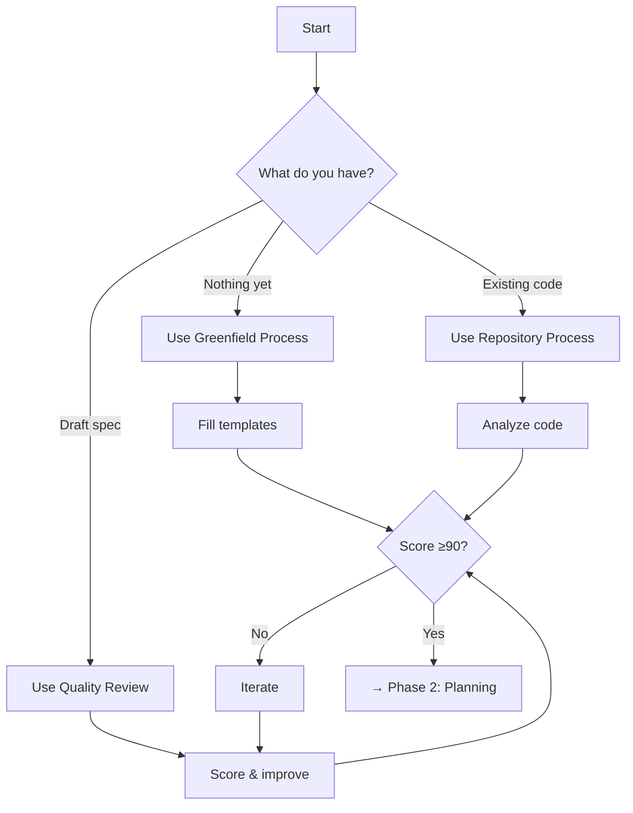

# Phase 1: Spec Creation

## Overview

This phase produces a high-quality specification (SPEC.md) that scores 90+ on our quality rubric. Choose your path based on your starting point.

## Process Selection



## Available Processes

### 1. [Greenfield Spec Process](01-greenfield-spec-process.md)
**When to use**: Starting a brand new project

**What it does**:
- Guides you through requirements discovery
- Uses templates to ensure completeness
- Builds spec from business outcomes down

**Prerequisites**:
- Clear problem statement
- Stakeholder access
- Time for discovery (20-30 hours)

### 2. [Repository Spec Process](02-repository-spec-process.md)
**When to use**: You have existing code but no spec

**What it does**:
- Analyzes codebase systematically
- Reverse-engineers requirements
- Documents current architecture
- Identifies gaps and technical debt

**Prerequisites**:
- Access to complete codebase
- Understanding of system purpose
- Time for analysis (15-25 hours)

### 3. [Spec Quality Review](03-spec-quality-review.md)
**When to use**: You have a spec that needs improvement

**What it does**:
- Scores spec across 4 dimensions
- Identifies specific improvements
- Guides iteration cycles
- Ensures 90+ quality score

**Prerequisites**:
- Existing SPEC.md
- Willingness to iterate
- Time for improvement (5-15 hours)

## Quality Standards

All specs must achieve:
- **Completeness**: All sections present and detailed
- **Clarity**: Unambiguous, measurable requirements  
- **Implementability**: Technically feasible
- **Testability**: Clear acceptance criteria

**Target Score**: 90+ (required for standard approval)

## Templates You'll Need

### For Greenfield Process:
1. [Outcome Definition](../templates/requirements/outcome-definition.md)
2. [Acceptance Scenarios](../templates/requirements/acceptance-scenarios.md)
3. [Non-Functional Requirements](../templates/requirements/non-functional-requirements.md)
4. [User Stories](../templates/requirements/user-story.md)

### For Repository Process:
- Code analysis checklist (in process doc)
- Architecture documentation template
- Gap analysis framework

### For Quality Review:
- [Spec Quality Rubric](../templates/quality/spec-quality-rubric.md)
- [Improvement Checklist](../templates/quality/spec-improvement-checklist.md)

## Automation Support

### Generate Starting Template
```bash
python ../automation/generate-spec-template.py "Project Name"
```

### Check Quality Score
```bash
python ../automation/validation/score-spec-quality.py spec/SPEC.md
```

### Get Improvement Suggestions
```bash
python ../automation/improvement/suggest-spec-improvements.py spec/SPEC.md
```

### Validate Everything
```bash
python ../automation/validate-all.py spec/SPEC.md
```

## Success Criteria

✅ SPEC.md created with all required sections
✅ Quality score ≥ 90
✅ All stakeholders aligned
✅ Requirements are measurable
✅ Architecture is clear
✅ Risks are identified

## Common Pitfalls

❌ **Rushing through templates** - Take time for thorough discovery
❌ **Skipping quality review** - Always score before proceeding
❌ **Vague requirements** - Make everything measurable
❌ **No stakeholder review** - Get buy-in before planning

## Next Phase

Once you achieve a 90+ quality score:
→ Continue to [Phase 2: Planning](../02-planning/)

## Getting Help

- **Low quality score?** Check [Spec Anti-patterns](../guides/spec-antipatterns.md)
- **Stuck on templates?** See [TaskMaster Example](../example-project/)
- **Process questions?** Each process file has detailed steps