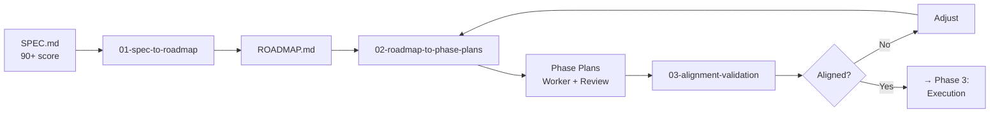

# Phase 2: Planning

## Overview

This phase transforms your high-quality spec (90+ score) into actionable plans: a phased roadmap and detailed work/review plans for each phase.

## Process Flow



## Planning Processes

### 1. [Spec to Roadmap](01-spec-to-roadmap.md)
**Purpose**: Break monolithic spec into manageable phases

**Key Activities**:
- Group related requirements
- Define phase boundaries
- Sequence dependencies
- Allocate resources
- Set milestones

**Output**: ROADMAP.md with 3-6 phases

### 2. [Roadmap to Phase Plans](02-roadmap-to-phase-plans.md)
**Purpose**: Create detailed execution plans for each phase

**Key Activities**:
- Break phases into work packages
- Create task-level details
- Define review criteria
- Assign responsibilities
- Estimate effort

**Outputs**: 
- WORK_PLAN.yml for each phase
- REVIEW_PLAN.yml for each phase

### 3. [Alignment Validation](03-alignment-validation.md)
**Purpose**: Ensure all documents are consistent

**Key Activities**:
- Verify requirement coverage
- Check resource consistency
- Validate timelines
- Confirm dependencies

**Output**: Alignment report with pass/fail

## Key Principles

### 1. Phasing Strategy
- **MVP First**: Deliver value quickly
- **Dependencies**: Earlier phases enable later ones
- **Risk Management**: High-risk items early
- **Learning**: Each phase informs the next

### 2. Work Breakdown
- **Right-sized**: 1-2 week work packages
- **Clear ownership**: One responsible person
- **Measurable**: Specific deliverables
- **Testable**: Acceptance criteria

### 3. Resource Planning
- **Skills-based**: Match tasks to capabilities
- **Realistic**: Account for meetings, reviews
- **Buffered**: Include contingency
- **Balanced**: Avoid overloading individuals

## Templates

### For Roadmap Creation:
- [Roadmap Template](../templates/planning/roadmap-template.md)
- [Complexity Factors](../templates/decision-support/complexity-factors.md)
- [Team Skills Matrix](../templates/planning/team-skills-matrix.md)

### For Phase Planning:
- [Worker Plan Template](../templates/planning/worker-plan.yml)
- [Review Plan Template](../templates/planning/review-plan.yml)
- [Estimation Calibration](../templates/decision-support/estimation-calibration.md)

## Quality Checks

### Roadmap Quality:
- [ ] All requirements mapped to phases
- [ ] Dependencies clearly sequenced
- [ ] Resource allocation realistic
- [ ] Milestones measurable
- [ ] Risks identified per phase

### Phase Plan Quality:
- [ ] Every task has owner
- [ ] Estimates include contingency
- [ ] Review points defined
- [ ] Success criteria clear
- [ ] Test approach included

### Alignment Quality:
- [ ] Requirements trace through all docs
- [ ] Timelines match across documents
- [ ] Resources consistently allocated
- [ ] No conflicting information

## Automation Support

### Validate Alignment
```bash
python ../automation/validation/validate-alignment.py .
```

### Check Requirements Coverage
```bash
python ../automation/validation/validate-requirements-traceability.py spec/SPEC.md
```

## Common Patterns

### Typical Phase Structure:
1. **Phase 0**: Foundation (infrastructure, setup)
2. **Phase 1**: Core Features (MVP)
3. **Phase 2**: Enhanced Features
4. **Phase 3**: Integration & Polish
5. **Phase 4**: Scale & Optimize

### Work Package Patterns:
- Research spike (time-boxed investigation)
- Implementation (build functionality)
- Integration (connect components)
- Testing (verify quality)
- Documentation (capture knowledge)

## Success Criteria

✅ Roadmap covers 100% of requirements
✅ Each phase has clear value delivery
✅ All plans pass alignment validation
✅ Resources mapped to capabilities
✅ Realistic timelines with buffers

## Next Phase

After alignment validation passes:
→ Continue to [Phase 3: Execution](../03-execution/)

## Troubleshooting

**Problem**: Can't fit everything in timeline
- Review priorities with stakeholders
- Consider parallel work streams
- Look for scope reduction opportunities

**Problem**: Alignment validation fails
- Check version consistency
- Verify requirement IDs match
- Ensure timeline additions are correct

**Problem**: Resource conflicts
- Review team skills matrix
- Consider training time
- Plan for knowledge transfer