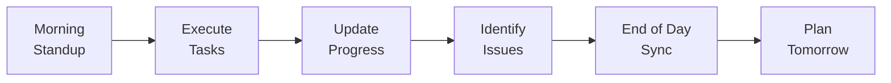

# Phase Execution Guide

---
Previous: [Alignment Validation](../02-planning/03-alignment-validation.md)
Related: 
  - [Change Management](02-change-management.md) - When scope changes
  - [Failure Recovery](03-failure-recovery.md) - When issues arise
---

## Overview

This guide provides standard operating procedures for executing phase plans created in the planning stage.

## Prerequisites

Before starting phase execution:
- ✅ Phase plans (worker + review) completed
- ✅ Alignment validation passed
- ✅ Team assembled and onboarded
- ✅ Development environment ready
- ✅ Stakeholder kick-off complete

## Execution Rhythm

### Daily Cycle



#### Morning Standup (15 min)
**Format**: Brief, focused, standing
**Agenda**:
1. Yesterday's accomplishments
2. Today's plan
3. Blockers/risks
4. Help needed

**Template**:
```
Team Member: [Name]
Yesterday: Completed [specific deliverable]
Today: Working on [specific task]
Blockers: [None/specific issue]
```

#### During Execution
- Follow work package tasks in order
- Update task status in real-time
- Document decisions as made
- Raise blockers immediately
- Collaborate per plan

#### End of Day Sync
- Update task board
- Log actual vs estimated time
- Document any new findings
- Prepare tomorrow's priorities

### Weekly Cycle

**Monday**: Week planning and goal setting
**Tuesday-Thursday**: Focused execution
**Friday**: Week wrap-up and retrospective

## Work Package Management

### Starting a Work Package

1. **Review Package Details**
   - Understand deliverables
   - Check dependencies resolved
   - Confirm acceptance criteria
   - Identify risks

2. **Setup Work**
   - Create feature branch
   - Setup test environment
   - Gather needed resources
   - Schedule reviews

3. **Communication**
   - Notify team of start
   - Confirm reviewer availability
   - Set expectations

### During Work Package

Follow the TDD cycle (if applicable):
```
1. Write failing test
2. Implement minimum code
3. Refactor
4. Document
5. Review
```

Track progress:
- [ ] 25% - Initial implementation
- [ ] 50% - Core functionality
- [ ] 75% - Edge cases handled
- [ ] 100% - Reviewed and merged

### Completing Work Package

**Definition of Done**:
- [ ] All tasks complete
- [ ] Tests passing (coverage met)
- [ ] Code reviewed and approved
- [ ] Documentation updated
- [ ] Deployed to staging
- [ ] Acceptance criteria verified

## Progress Tracking

### Metrics to Track Daily

| Metric | Target | How to Measure |
|--------|--------|----------------|
| Tasks Completed | Per plan | Task board |
| Velocity | Baseline +/- 10% | Story points |
| Blocker Time | <4 hours | Time to resolution |
| Test Coverage | >85% | Coverage reports |
| Build Success | >95% | CI/CD dashboard |

### Visualization

Use a Kanban board:
```
| Backlog | Ready | In Progress | Review | Done |
|---------|-------|-------------|--------|------|
| Task 5  | Task 3| Task 2 (AM) | Task 1 |      |
| Task 6  | Task 4|             |        |      |
```

Update throughout the day.

## Quality Checkpoints

### Code Quality
- Peer review required for all changes
- Automated linting must pass
- Security scanning on each commit
- Performance benchmarks met

### Testing
- Unit tests for new code
- Integration tests for APIs
- E2E tests for user flows
- Load tests for performance

### Documentation
- Code comments for complex logic
- API documentation updated
- User guides for new features
- Architecture decisions recorded

## Communication Protocols

### Internal Team

**Real-time**: Slack/Teams channel
**Async**: Email for decisions
**Face-to-face**: Complex discussions

### Stakeholder Updates

**Weekly Status Email**:
```
Subject: [Project] Week X Status Update

Progress:
- Completed: [List deliverables]
- In Progress: [Current work]
- Next Week: [Planned work]

Metrics:
- On Schedule: Yes/No [explanation]
- Budget: X% consumed
- Quality: [Key metrics]

Risks/Issues:
- [Risk]: [Mitigation]

Decisions Needed:
- [Decision]: [By when]
```

### Escalation Path

1. **Technical Blockers**
   - Try: Team problem-solving (2 hrs)
   - Then: Technical lead
   - Finally: External expert

2. **Resource Issues**
   - Try: Team reallocation
   - Then: Project manager
   - Finally: Steering committee

3. **Scope Questions**
   - Try: Check spec/plans
   - Then: Product owner
   - Finally: Stakeholder group

## Risk Management

### Daily Risk Review

Ask:
- What could block us today?
- What assumptions are we making?
- What dependencies exist?
- What's our Plan B?

### Risk Register Update

| Risk | Probability | Impact | Mitigation | Owner | Status |
|------|-------------|--------|------------|-------|--------|
| [Risk description] | L/M/H | L/M/H | [Action] | [Name] | [Active/Closed] |

Update weekly or when risks change.

## Phase Completion

### Exit Criteria
- [ ] All work packages delivered
- [ ] Review plan items addressed
- [ ] Quality gates passed
- [ ] Performance targets met
- [ ] Documentation complete
- [ ] Stakeholder sign-off

### Phase Retrospective

**Agenda** (2 hours):
1. Metrics review (30 min)
2. What went well (30 min)
3. What could improve (30 min)
4. Action items (30 min)

**Output**: Lessons learned document

### Handoff to Next Phase
- Knowledge transfer sessions
- Documentation handoff
- Environment details
- Open items list
- Contact information

## Tools and Templates

### Recommended Tools
- **Task Tracking**: Jira, Trello, Azure DevOps
- **Communication**: Slack, Teams
- **Documentation**: Wiki, Confluence
- **Code**: GitHub, GitLab
- **CI/CD**: Jenkins, GitHub Actions

### Daily Templates
- Standup notes
- Blocker log
- Decision record
- Time tracking

### Weekly Templates
- Status report
- Metrics dashboard
- Risk register
- Retrospective notes

## Continuous Improvement

### Daily
- Adjust task order based on learning
- Optimize workflows
- Share knowledge bits

### Weekly  
- Review estimation accuracy
- Refine processes
- Update documentation

### Phase End
- Major process improvements
- Tool evaluations
- Team skill development

## Next Steps

**During Execution**:
- If changes needed → [Change Management](02-change-management.md)
- If blocked → [Failure Recovery](03-failure-recovery.md)

**Phase Complete**:
- Run phase retrospective
- Update roadmap if needed
- Prepare next phase
- Celebrate success!

---

Remember: Consistent execution rhythm + clear communication + quality focus = successful delivery