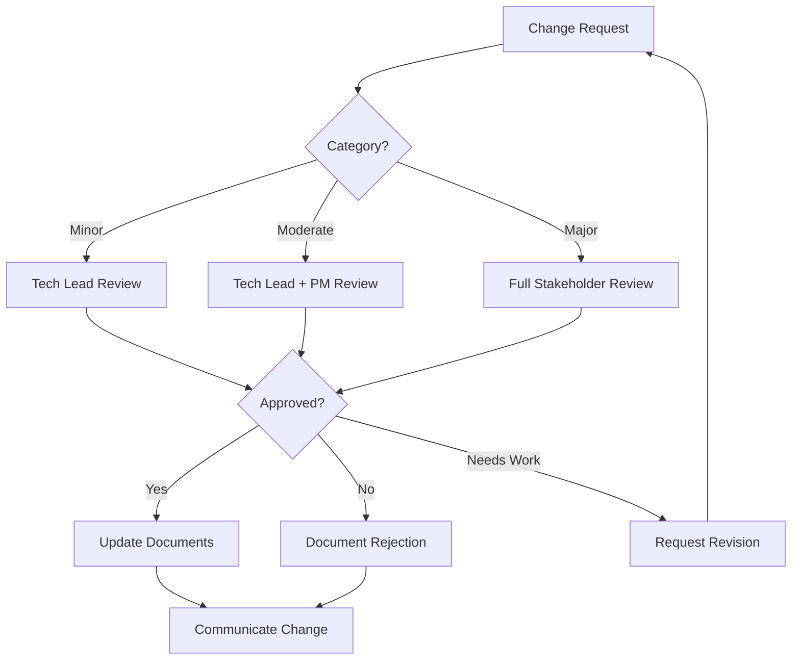

# Change Management Process

---
Previous: [Phase Execution Guide](01-phase-execution-guide.md)
Next: [Failure Recovery](03-failure-recovery.md)
Related:
  - [Phase Execution Guide](01-phase-execution-guide.md) - Normal execution flow
  - [Failure Recovery](03-failure-recovery.md) - When issues arise
  - [Alignment Validation](../02-planning/03-alignment-validation.md) - Post-change validation
---

## Overview
This process manages changes to specifications, roadmaps, and phase plans after they've been baselined. It balances flexibility with control, ensuring changes are properly evaluated without creating bureaucratic obstacles.

## Change Categories

### Category 1: Minor Changes (Low Impact)
**Definition**: Changes that don't affect timeline, budget, or interfaces
**Examples**:
- Clarifying ambiguous wording
- Adding missing examples
- Correcting typos or formatting
- Internal refactoring within a component

**Process**: Streamlined approval
- Document in change log
- Technical lead approval only
- Apply immediately
- Update version number (x.x.1)

### Category 2: Moderate Changes (Medium Impact)
**Definition**: Changes affecting single phase or component
**Examples**:
- Adding small feature within phase
- Changing implementation approach
- Modifying internal interfaces
- Adjusting test strategies

**Process**: Standard approval
- Complete change request form
- Impact analysis required
- Technical lead + PM approval
- 24-hour review period
- Update version number (x.1.0)

### Category 3: Major Changes (High Impact)
**Definition**: Changes affecting multiple phases, timeline, or budget
**Examples**:
- New requirements after baselining
- Architecture changes
- Scope increases
- External interface changes

**Process**: Full approval
- Detailed change request
- Comprehensive impact analysis
- Stakeholder approval required
- 48-72 hour review period
- Update version number (2.0.0)

## Change Request Process

### Step 1: Change Identification

**Change Request Form**:
```markdown
## Change Request #[XXX]

### Requester Information
- Name: 
- Role:
- Date:
- Urgency: [Low/Medium/High/Critical]

### Change Description
**Current State**: 
[What exists today]

**Proposed Change**:
[What should change]

**Reason for Change**:
[Why this is needed]

### Initial Classification
- Category: [Minor/Moderate/Major]
- Affected Documents: [List all impacted files]
- Affected Phases: [List impacted phases]
```

### Step 2: Impact Analysis

**For Moderate and Major Changes**:

```markdown
## Impact Analysis

### Schedule Impact
- Current Phase Impact: [None/Days/Weeks]
- Downstream Impact: [None/Days/Weeks]
- Critical Path Affected: [Yes/No]

### Resource Impact
- Additional Effort: [Hours/Days]
- Skills Required: [List]
- Team Members Affected: [List]

### Technical Impact
- Architecture Changes: [None/Minor/Major]
- Interface Changes: [List]
- Testing Impact: [Additional test cases needed]
- Risk Assessment: [New risks introduced]

### Cost Impact
- Direct Costs: [Amount]
- Indirect Costs: [Opportunity cost]
- ROI Justification: [Value vs Cost]

### Alternatives Considered
1. Do Nothing: [Impact of not making change]
2. Alternative A: [Description and why not chosen]
3. Alternative B: [Description and why not chosen]
```

### Step 3: Approval Workflow



### Step 4: Implementation

**Once Approved**:

1. **Update Documentation**
   - Check out affected documents
   - Make changes with track changes on
   - Update version numbers
   - Add change log entry

2. **Version Control**
   ```
   git checkout -b change-request-XXX
   # Make changes
   git commit -m "CR-XXX: [Brief description]"
   git push origin change-request-XXX
   # Create PR with change details
   ```

3. **Communication Plan**
   - Email to affected teams
   - Update project dashboard
   - Standup announcement
   - Training if needed

### Step 5: Verification

**Change Verification Checklist**:
- [ ] All documents updated consistently
- [ ] Version numbers incremented
- [ ] Change log updated
- [ ] Stakeholders notified
- [ ] Downstream impacts addressed
- [ ] Test plans updated if needed
- [ ] Risk register updated

## Change Log Format

Maintain in each major document:

```markdown
## Change Log

### Version 2.1.0 - 2024-XX-XX
**CR-045** (Moderate): Added performance monitoring requirements
- Impact: Phase 3 extended by 3 days
- Sections updated: 3.2, 5.4, 7.1
- Approved by: Tech Lead, PM

### Version 2.0.1 - 2024-XX-XX  
**CR-044** (Minor): Clarified API rate limit specifications
- Impact: None
- Sections updated: 4.3.2
- Approved by: Tech Lead
```

## Emergency Change Process

For critical production issues or security vulnerabilities:

1. **Immediate Action**
   - Verbal approval from any senior stakeholder
   - Document change while implementing
   - Apply fix immediately

2. **Retroactive Documentation**
   - Complete change request within 24 hours
   - Full impact analysis within 48 hours
   - Lessons learned within 1 week

## Change Metrics and Improvement

### Track These Metrics
- Changes per phase
- Change approval time
- Change implementation time
- Changes rejected/revised
- Emergency changes
- Root cause of changes

### Monthly Review Questions
1. Are we getting too many changes? (>20% indicates poor initial spec)
2. Are changes taking too long? (>48h average indicates process issues)
3. Are emergency changes frequent? (>1/month indicates planning issues)
4. What's driving changes? (Requirements unclear vs. external factors)

## Anti-Patterns to Avoid

### 1. Change Freeze
**Problem**: "No changes after baseline!"
**Why it fails**: Real world doesn't stop
**Better approach**: Controlled change with proper impact analysis

### 2. Rubber Stamp Approval
**Problem**: Approving everything without analysis
**Why it fails**: Cumulative impact derails project
**Better approach**: Quick but thorough review

### 3. Change by Stealth
**Problem**: Making changes without process
**Why it fails**: Inconsistencies and confusion
**Better approach**: Use emergency process if needed

### 4. Analysis Paralysis
**Problem**: Over-analyzing minor changes
**Why it fails**: Slows progress unnecessarily
**Better approach**: Right-size analysis to change impact

## Templates and Tools

### Quick Reference Decision Tree
```
Is this a clarification only? 
  → Yes: Minor change
  → No: Continue
  
Does it affect other teams/phases?
  → No: Likely Moderate
  → Yes: Continue
  
Does it change timeline/budget/architecture?
  → Yes: Major change
  → No: Moderate change
```

### Change Request Template Links
- [Minor Change Form](../templates/change-request-minor.md)
- [Standard Change Form](../templates/change-request-standard.md)
- [Emergency Change Form](../templates/change-request-emergency.md)

## Integration with Existing Processes

### During Spec Development
- Changes are just iterations
- No formal process needed
- Track in spec improvement log

### During Roadmap/Planning
- Use change process for baseline adjustments
- Batch changes when possible
- Consider replanning if >30% change

### During Execution
- Full change process applies
- Consider phase boundaries for major changes
- Emergency process for blockers

## Key Success Factors

1. **Right-sized Process**: Match rigor to impact
2. **Fast Turnaround**: 24-48 hour decisions
3. **Clear Communication**: Everyone knows what changed
4. **Learning Culture**: Changes reveal improvements
5. **Traceability**: Can track why changes were made

Remember: Change is inevitable. Good change management makes it manageable.