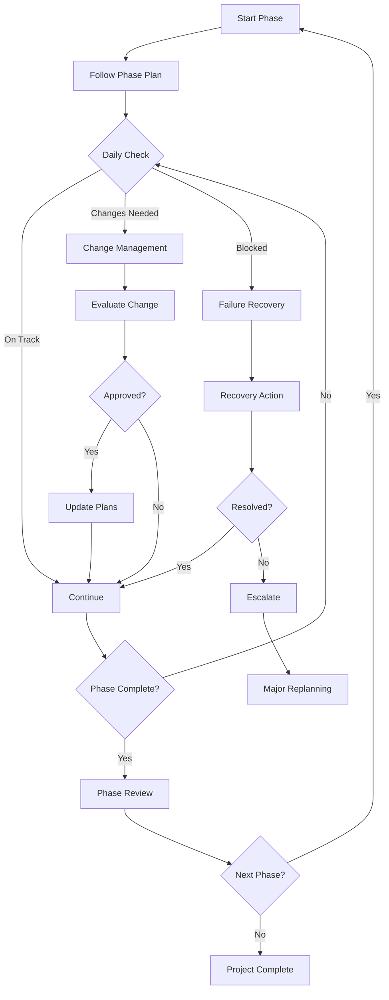

# Phase 3: Execution

## Overview

This phase provides guidance for executing the plans created in Phase 2, handling changes, and recovering from issues.

## Execution Flow

## Execution Guides

### 1. [Phase Execution Guide](01-phase-execution-guide.md)
**Purpose**: Standard operating procedures for running phases

**Key Topics**:
- Daily execution rhythm
- Work package management
- Progress tracking
- Communication patterns
- Quality checkpoints

**When to use**: At the start of each phase

### 2. [Change Management](02-change-management.md)
**Purpose**: Control scope and requirement changes

**Change Categories**:
- **Minor**: No impact on timeline/budget
- **Moderate**: Single phase impact
- **Major**: Multi-phase or architecture impact

**Process**:
1. Document change request
2. Assess impact
3. Get approval
4. Update plans
5. Communicate change

### 3. [Failure Recovery](03-failure-recovery.md)
**Purpose**: Get back on track when things go wrong

**Common Failures**:
- Technical blockers
- Resource unavailability
- Requirement misunderstanding
- Integration issues
- Performance problems

**Recovery Process**:
1. Assess situation
2. Identify root cause
3. Develop options
4. Execute recovery
5. Prevent recurrence

## Daily Execution Checklist

### Morning Standup
- [ ] Review yesterday's progress
- [ ] Identify today's priorities
- [ ] Surface any blockers
- [ ] Confirm resource availability

### During the Day
- [ ] Follow work package tasks
- [ ] Update progress in real-time
- [ ] Communicate issues immediately
- [ ] Document decisions made

### End of Day
- [ ] Update task status
- [ ] Log actual vs estimated time
- [ ] Note any new risks
- [ ] Prepare for tomorrow

## Key Metrics to Track

### Progress Metrics
- Tasks completed vs planned
- Story points delivered
- Actual vs estimated effort
- Blocker resolution time

### Quality Metrics
- Test coverage
- Defect rates
- Code review turnaround
- Documentation completeness

### Process Metrics
- Change request frequency
- Recovery actions needed
- Estimation accuracy
- Team velocity

## Communication Protocols

### Status Reporting
**Daily**: Team standup (15 min)
**Weekly**: Stakeholder update
**Phase End**: Comprehensive review

### Issue Escalation
1. **Level 1**: Team lead (same day)
2. **Level 2**: Project manager (within 24h)
3. **Level 3**: Steering committee (within 48h)

### Change Communication
- All changes logged in change register
- Approved changes communicated within 24h
- Plan updates distributed within 48h

## Quality Gates

### Work Package Completion
- [ ] All tasks done
- [ ] Tests passing
- [ ] Code reviewed
- [ ] Documentation updated

### Phase Completion
- [ ] All work packages delivered
- [ ] Integration testing passed
- [ ] Performance targets met
- [ ] Stakeholder acceptance

## Tools and Artifacts

### Tracking Tools
- Task board (Kanban/Scrum)
- Burndown charts
- Risk register
- Change log

### Key Documents
- Daily status reports
- Weekly summaries
- Phase completion reports
- Lessons learned

## Common Execution Patterns

### Successful Patterns
✅ Daily standups keep team aligned
✅ Early escalation prevents major issues
✅ Regular demos maintain stakeholder engagement
✅ Continuous integration reduces integration risk

### Anti-patterns to Avoid
❌ Hiding problems until too late
❌ Scope creep through informal requests
❌ Skipping quality gates to save time
❌ Not updating plans when things change

## Phase Exit Criteria

Before moving to next phase:
- [ ] All deliverables complete
- [ ] Quality gates passed
- [ ] Stakeholder sign-off obtained
- [ ] Lessons learned documented
- [ ] Next phase team ready

## Continuous Improvement

### Weekly Retrospectives
- What went well?
- What could improve?
- What will we try next week?

### Phase Retrospectives
- Estimation accuracy review
- Process improvement ideas
- Team development needs
- Tool effectiveness

## Next Steps

**Phase Complete?**
- Conduct phase review
- Document lessons learned
- Prepare next phase team
- Update roadmap if needed

**Project Complete?**
- Final acceptance testing
- Handover to operations
- Project retrospective
- Success celebration!