# Examples of How Files Should Link Together

## Navigation Headers for Sequential Files

### Example 1: Spec Creation Flow

**File: `01-spec-creation/01-greenfield-spec-process.md`**
```markdown
---
Previous: [README](../README.md) - Start Here
Next: [03-spec-quality-review.md](03-spec-quality-review.md) - Review Your Spec
Alternate Path: [02-repository-spec-process.md](02-repository-spec-process.md) - If Working with Existing Code
---

# Greenfield Spec Creation Process
[content...]

## Next Steps
Once you've completed your initial spec:
1. Run quality scoring: `python automation/validation/score-spec-quality.py`
2. If score < 90, proceed to [Spec Quality Review](03-spec-quality-review.md)
3. If score ≥ 90, proceed to [Creating a Roadmap](../02-planning/01-spec-to-roadmap.md)
```

**File: `01-spec-creation/03-spec-quality-review.md`**
```markdown
---
Previous: [01-greenfield-spec-process.md](01-greenfield-spec-process.md) or [02-repository-spec-process.md](02-repository-spec-process.md)
Next: [01-spec-to-roadmap.md](../02-planning/01-spec-to-roadmap.md) - After Achieving 90+ Score
Tools: [suggest-spec-improvements.py](../automation/improvement/suggest-spec-improvements.py)
---

# Spec Quality Review and Improvement
[content...]

## Success Criteria
- Quality score ≥ 90 for standard approval
- All high-priority improvements addressed
- Stakeholder sign-off obtained

## Next Steps
After achieving a 90+ quality score:
→ Continue to [Spec to Roadmap Process](../02-planning/01-spec-to-roadmap.md)
```

### Example 2: Planning Phase Flow

**File: `02-planning/01-spec-to-roadmap.md`**
```markdown
---
Previous: [03-spec-quality-review.md](../01-spec-creation/03-spec-quality-review.md) - Requires 90+ Score
Next: [02-roadmap-to-phase-plans.md](02-roadmap-to-phase-plans.md) - Detail Your Phases
Templates: [roadmap-template.md](../templates/planning/roadmap-template.md)
---

# From Spec to Roadmap
[content...]

## Prerequisites
- ✅ Completed SPEC with 90+ quality score
- ✅ Stakeholder alignment on priorities
- ✅ Resource constraints understood

## Outputs
- ROADMAP.md with phased delivery plan
- Clear milestones and dependencies
- Resource allocation by phase

## Next Steps
→ Continue to [Roadmap to Phase Plans](02-roadmap-to-phase-plans.md)
```

### Example 3: Execution Phase with Branches

**File: `03-execution/01-phase-execution-guide.md`**
```markdown
---
Previous: [03-alignment-validation.md](../02-planning/03-alignment-validation.md)
Related: 
  - [02-change-management.md](02-change-management.md) - When Scope Changes
  - [03-failure-recovery.md](03-failure-recovery.md) - When Issues Arise
---

# Phase Execution Guide
[content...]

## During Execution
- If changes needed → [Change Management Process](02-change-management.md)
- If blockers occur → [Failure Recovery Guide](03-failure-recovery.md)
- For progress tracking → Use worker plan checkpoints
```

## Cross-Reference Examples

### In Process Files

**Referencing Templates:**
```markdown
## Step 3: Fill Out Requirements Templates

Use these templates in order:
1. [Outcome Definition](../templates/requirements/outcome-definition.md) - Start here
2. [Acceptance Scenarios](../templates/requirements/acceptance-scenarios.md) - User journeys
3. [Non-Functional Requirements](../templates/requirements/non-functional-requirements.md) - Quality attributes

💡 See [TaskMaster Example](../example-project/requirements/) for completed templates.
```

**Referencing Automation:**
```markdown
## Validation Steps

Run these scripts to check your work:
```bash
# Check structure
python automation/validation/validate-spec-structure.py spec/SPEC.md

# Score quality
python automation/validation/score-spec-quality.py spec/SPEC.md

# Or run all validations
python automation/validate-all.py spec/SPEC.md
```
See [Automation README](../automation/README.md) for script details.
```

### In Templates

**Linking to Process:**
```markdown
<!-- In templates/requirements/outcome-definition.md -->

# Outcome Definition Template

> 📖 This template is used in [Greenfield Spec Process](../01-spec-creation/01-greenfield-spec-process.md#step-2-define-outcomes)

## Instructions
[template content...]

## Example
See completed example: [TaskMaster Outcome Definition](../example-project/requirements/outcome-definition-filled.md)

## Next Template
After completing outcomes, proceed to [Acceptance Scenarios](acceptance-scenarios.md)
```

### In Guides

**Referencing Multiple Related Items:**
```markdown
<!-- In guides/spec-antipatterns.md -->

# Spec Anti-Patterns Guide

## Related Resources
- Process: [Spec Quality Review](../01-spec-creation/03-spec-quality-review.md)
- Tool: [Improvement Suggestions](../automation/improvement/suggest-spec-improvements.py)
- Template: [Quality Rubric](../templates/quality/spec-quality-rubric.md)
- Example: [What NOT to do](../examples/antipattern-examples/)
```

## Directory README Examples

### Phase Directory README
**File: `01-spec-creation/README.md`**
```markdown
# Phase 1: Spec Creation

## Choose Your Path

```mermaid
graph TD
    A[Start] --> B{Project Type?}
    B -->|New Project| C[01-greenfield-spec-process.md]
    B -->|Existing Code| D[02-repository-spec-process.md]
    C --> E[03-spec-quality-review.md]
    D --> E
    E --> F{Score ≥90?}
    F -->|Yes| G[→ Phase 2: Planning]
    F -->|No| H[Improve]
    H --> E
```



## Process Files
1. [Greenfield Spec Process](01-greenfield-spec-process.md) - Start from requirements
2. [Repository Spec Process](02-repository-spec-process.md) - Reverse-engineer from code
3. [Spec Quality Review](03-spec-quality-review.md) - Achieve 90+ quality score

## Quick Decision
- **New project?** → Use Greenfield process
- **Have code?** → Use Repository process
- **Score < 90?** → Use Quality Review process

## Success Criteria
✅ Spec created with all required sections
✅ Quality score ≥ 90
✅ Stakeholder approval obtained

## Next Phase
→ [Phase 2: Planning](../02-planning/)
```

## Linking Best Practices

### 1. Navigation Headers
Every process file should have:
```markdown
---
Previous: [Where you came from]
Next: [Where to go next]
Alternate: [Other options]
Templates: [What templates to use]
Tools: [What scripts help here]
---
```

### 2. Prerequisites Section
Clear entry criteria:
```markdown
## Prerequisites
- ✅ Previous step completed
- ✅ Required score/approval achieved
- ✅ Necessary templates filled
```

### 3. Next Steps Section
Clear exit paths:
```markdown
## Next Steps
- If X → Go to [Process A]
- If Y → Go to [Process B]
- Always → Run [Validation C]
```

### 4. Contextual Links
Link when mentioned:
- "Use the outcome definition template" → [Outcome Definition](link)
- "Run quality scoring" → `python [script]` with link to docs
- "See example" → [TaskMaster Example](link)

### 5. Visual Flows
Include diagrams showing relationships:


This creates a self-documenting, easily navigable structure where users always know:
- Where they are
- Where they came from  
- Where to go next
- What tools to use
- What templates apply