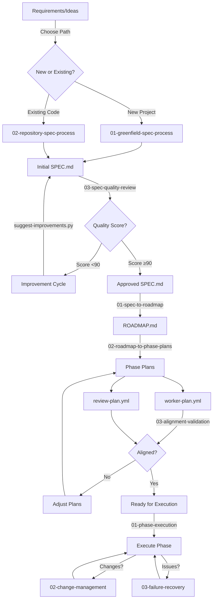

# Spec-to-Execution Process Flow

## Overview
This document provides a complete view of the specification-to-execution pipeline, showing how each process connects to create a seamless workflow from initial requirements to executable phase plans.

## Process Flow Diagram



## Process Phases

### Phase 1: Spec Creation (01-spec-creation/)

Choose your path based on project type:

| Starting Point | Process | Duration | Output |
|----------------|---------|----------|--------|
| New Project | [`01-greenfield-spec-process.md`](01-spec-creation/01-greenfield-spec-process.md) | 20-30 hrs | Complete SPEC.md |
| Existing Code | [`02-repository-spec-process.md`](01-spec-creation/02-repository-spec-process.md) | 15-25 hrs | Reverse-engineered SPEC.md |
| Any Spec | [`03-spec-quality-review.md`](01-spec-creation/03-spec-quality-review.md) | 5-15 hrs | 90+ quality score |

**Key Activities**:
- Requirements discovery using templates
- Stakeholder interviews and analysis
- Architecture design and documentation
- Risk identification and mitigation
- Quality scoring and improvement

**Quality Gate**: SPEC must score 90+ before proceeding

### Phase 2: Planning (02-planning/)

Transform spec into actionable plans:

| Step | Process | Duration | Output |
|------|---------|----------|--------|
| 1 | [`01-spec-to-roadmap.md`](02-planning/01-spec-to-roadmap.md) | 7-12 hrs | Phased roadmap |
| 2 | [`02-roadmap-to-phase-plans.md`](02-planning/02-roadmap-to-phase-plans.md) | 4-6 hrs/phase | Work & review plans |
| 3 | [`03-alignment-validation.md`](02-planning/03-alignment-validation.md) | 2-3 hrs | Validation report |

**Key Activities**:
- Break spec into logical phases
- Define dependencies and sequence
- Create detailed work packages
- Establish review criteria
- Validate alignment across documents

**Quality Gate**: All documents must align

### Phase 3: Execution (03-execution/)

Manage implementation with clear processes:

| Situation | Process | Purpose |
|-----------|---------|---------|
| Normal execution | [`01-phase-execution-guide.md`](03-execution/01-phase-execution-guide.md) | Daily/weekly rhythm |
| Scope changes | [`02-change-management.md`](03-execution/02-change-management.md) | Control modifications |
| Issues arise | [`03-failure-recovery.md`](03-execution/03-failure-recovery.md) | Get back on track |

**Key Activities**:
- Daily standups and progress tracking
- Work package management
- Quality checkpoints
- Risk monitoring
- Stakeholder communication

## Time Investment

| Phase | Stage | Duration | Running Total |
|-------|-------|----------|---------------|
| **Spec Creation** | | | |
| | Requirements | 4-8 hrs | 4-8 hrs |
| | Spec Development | 16-22 hrs | 20-30 hrs |
| | Quality Review | 5-15 hrs | 25-45 hrs |
| **Planning** | | | |
| | Roadmap | 7-12 hrs | 32-57 hrs |
| | Phase Plans | 12-18 hrs | 44-75 hrs |
| | Alignment | 2-3 hrs | 46-78 hrs |
| **Setup** | | | |
| | Execution Prep | 4-6 hrs | 50-84 hrs |

## Templates and Tools

### Requirements Templates (Phase 1)
- `outcome-definition.md` - Business and user outcomes
- `acceptance-scenarios.md` - Test scenarios
- `non-functional-requirements.md` - Quality attributes
- `user-story.md` - Individual stories
- `use-case.md` - Detailed use cases

### Planning Templates (Phase 2)
- `roadmap-template.md` - Phase structure
- `worker-plan.yml` - Execution details
- `review-plan.yml` - Quality checks
- `team-skills-matrix.md` - Resource planning

### Decision Support
- `complexity-factors.md` - Estimation help
- `estimation-calibration.md` - Improve accuracy
- `decision-matrix.md` - Technology choices

### Automation Scripts
```bash
# Generate new project structure
python automation/generate-spec-template.py "Project Name"

# Check spec quality
python automation/validation/score-spec-quality.py spec/SPEC.md

# Get improvement suggestions
python automation/improvement/suggest-spec-improvements.py spec/SPEC.md

# Validate everything
python automation/validate-all.py spec/SPEC.md

# Check alignment (after planning)
python automation/validation/validate-alignment.py .
```

## Quality Standards

### Spec Quality
- **Target Score**: 90+ (required for standard approval)
- **Dimensions**: Completeness, Clarity, Implementability, Testability
- **Each Dimension**: 25 points maximum

### Planning Quality
- **Requirement Coverage**: 100%
- **Dependency Management**: All identified and sequenced
- **Resource Allocation**: Skills matched to tasks
- **Risk Mitigation**: All high risks addressed

### Execution Quality
- **Daily Tracking**: Progress visible
- **Quality Gates**: No skipping
- **Communication**: Proactive and clear
- **Change Control**: All changes documented

## Common Patterns and Anti-patterns

### Success Patterns
✅ **Thorough Discovery**: Spend time understanding before building
✅ **Quality Gates**: Don't proceed with low-quality artifacts
✅ **Clear Communication**: Over-communicate rather than under
✅ **Continuous Validation**: Check alignment regularly

### Anti-patterns to Avoid
❌ **Rushing Specs**: Low quality specs = project failure
❌ **Skipping Reviews**: Missing issues early = expensive fixes
❌ **Informal Changes**: Scope creep destroys timelines
❌ **Assuming Understanding**: Verify, don't assume

## Role Responsibilities

| Role | Spec Creation | Planning | Execution |
|------|--------------|----------|-----------|
| **Product Owner** | Provide requirements, validate | Approve roadmap | Accept deliverables |
| **Tech Lead** | Review architecture | Validate feasibility | Technical decisions |
| **Developers** | Estimate complexity | Validate plans | Implement features |
| **QA** | Define test scenarios | Review test approach | Execute testing |

## Process Metrics

### Success Indicators
- **First-time Approval Rate**: >80%
- **Spec Quality Score**: >90
- **Alignment Validation**: Pass first time
- **Schedule Adherence**: ±10%
- **Change Requests**: <20% of scope

### Improvement Metrics
- **Estimation Accuracy**: Track and calibrate
- **Defect Rates**: Reduce over time
- **Process Cycle Time**: Optimize without sacrificing quality
- **Team Satisfaction**: Regular retrospectives

## Quick Reference Checklist

```
Phase 1: Spec Creation
□ Choose correct process (greenfield vs repository)
□ Complete all required templates
□ Achieve 90+ quality score
□ Get stakeholder approval

Phase 2: Planning  
□ Create phased roadmap
□ Develop work and review plans
□ Validate alignment
□ Assign resources

Phase 3: Execution
□ Set up tracking systems
□ Establish communication channels
□ Define escalation paths
□ Begin phase 1
```

## Getting Help

- **Process Questions**: Check phase README files
- **Quality Issues**: Run improvement suggestions script
- **Alignment Problems**: Use validation scripts
- **Examples Needed**: See TaskMaster in example-project/

Remember: **Quality gates exist to ensure success**. Time invested in proper specs and planning saves multiples during execution.