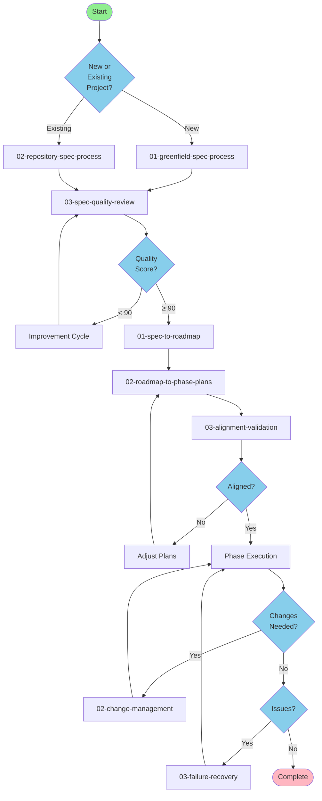

# Proposed Spec-Building Process Flow

## Visual Process Map



## Process Phases with File Mappings

### Phase 1: Spec Creation (01-spec-creation/)
Choose your starting point based on project type:

| Scenario | Use This Process | Key Difference |
|----------|------------------|----------------|
| **New Project** | `01-greenfield-spec-process.md` | Start from requirements templates |
| **Existing Code** | `02-repository-spec-process.md` | Reverse-engineer from codebase |
| **Quality Review** | `03-spec-quality-review.md` | Improve any spec to 90+ score |

**Templates Used:**
- `templates/requirements/outcome-definition.md`
- `templates/requirements/acceptance-scenarios.md`
- `templates/requirements/non-functional-requirements.md`
- `templates/quality/spec-quality-rubric.md`

**Automation:**
- `automation/generate-spec-template.py` - Quick start for new projects
- `automation/validation/score-spec-quality.py` - Check quality score
- `automation/improvement/suggest-spec-improvements.py` - Get specific suggestions

### Phase 2: Planning (02-planning/)
Transform spec into actionable plans:

| Step | Process | Output |
|------|---------|--------|
| 1 | `01-spec-to-roadmap.md` | Phased delivery roadmap |
| 2 | `02-roadmap-to-phase-plans.md` | Detailed work & review plans |
| 3 | `03-alignment-validation.md` | Consistency verification |

**Templates Used:**
- `templates/planning/roadmap-template.md`
- `templates/planning/worker-plan.yml`
- `templates/planning/review-plan.yml`
- `templates/planning/team-skills-matrix.md`
- `templates/decision-support/complexity-factors.md`

**Automation:**
- `automation/validation/validate-alignment.py` - Check document consistency
- `automation/validation/validate-requirements-traceability.py` - Ensure coverage

### Phase 3: Execution (03-execution/)
Manage the implementation:

| Situation | Use This Guide | Purpose |
|-----------|----------------|---------|
| **Starting Work** | `01-phase-execution-guide.md` | How to execute plans |
| **Scope Changes** | `02-change-management.md` | Control modifications |
| **Problems Arise** | `03-failure-recovery.md` | Get back on track |

**Templates Used:**
- `templates/decision-support/estimation-calibration.md`
- `templates/quality/review-checklist.md`

## Quick Decision Tree

```
Q: What do I need to do?
│
├─ Create a new spec
│  ├─ From scratch → 01-greenfield-spec-process.md
│  └─ From code → 02-repository-spec-process.md
│
├─ Improve existing spec → 03-spec-quality-review.md
│
├─ Plan implementation
│  ├─ Create roadmap → 01-spec-to-roadmap.md
│  ├─ Detail phases → 02-roadmap-to-phase-plans.md
│  └─ Validate alignment → 03-alignment-validation.md
│
└─ Handle execution issues
   ├─ Change request → 02-change-management.md
   └─ Recovery needed → 03-failure-recovery.md
```

## File Relationships

### Sequential Flow
1. **Spec Creation** → **Quality Review** → **Roadmap**
   - Any spec creation process leads to quality review
   - Only specs with 90+ score proceed to roadmap

2. **Roadmap** → **Phase Plans** → **Alignment**
   - Roadmap breaks into phase plans
   - Alignment validates all documents match

3. **Execution** ↔ **Change/Recovery**
   - Change management and recovery loop back to execution
   - May trigger updates to earlier documents

### Template Usage
- **Requirements templates** → Used in spec creation
- **Planning templates** → Used in roadmap and phase planning
- **Quality templates** → Used throughout for validation
- **Decision templates** → Used when making choices

### Automation Support
- **Validation scripts** → Run after each major step
- **Improvement script** → Use when quality score is low
- **Generate template** → Quick start for new projects
- **Validate all** → Comprehensive check before proceeding

## Key Improvements

1. **Clear Entry Points**: Two distinct paths for new vs existing projects
2. **Quality Gates**: Explicit score requirements before proceeding
3. **Linked Processes**: Numbered files show clear progression
4. **Distinct Purposes**: No overlap between greenfield and repository approaches
5. **Integrated Automation**: Scripts support each phase
6. **Failure Handling**: Clear paths for problems and changes