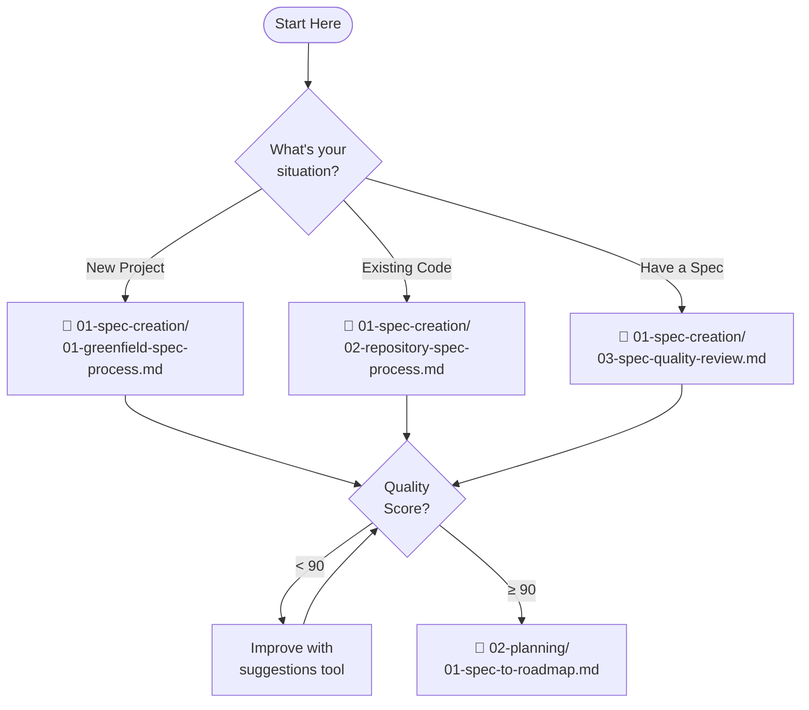

# Spec-Building Process Guide

## Quick Start

This guide helps you create robust, comprehensive specifications that score 90+ on our quality rubric and seamlessly transform into executable plans.

### What Do You Need?



## Directory Structure

```
spec-building/
├── 01-spec-creation/      # Create and refine specs
├── 02-planning/           # Transform specs into plans  
├── 03-execution/          # Manage implementation
├── templates/             # Reusable templates
├── guides/                # Best practices
├── automation/            # Validation scripts
└── examples/              # Complete examples
```

## Phase 1: Spec Creation

Choose your starting point:

| If you have... | Use this process | Output |
|----------------|------------------|--------|
| New project idea | [01-greenfield-spec-process](01-spec-creation/01-greenfield-spec-process.md) | Complete SPEC.md |
| Existing codebase | [02-repository-spec-process](01-spec-creation/02-repository-spec-process.md) | Reverse-engineered SPEC.md |
| Draft spec | [03-spec-quality-review](01-spec-creation/03-spec-quality-review.md) | Improved SPEC.md (90+ score) |

**Quick Start Template:**
```bash
python automation/generate-spec-template.py "Your Project Name"
```

## Phase 2: Planning

Transform your spec into actionable plans:

1. **[Spec to Roadmap](02-planning/01-spec-to-roadmap.md)** - Break into phases
2. **[Roadmap to Phase Plans](02-planning/02-roadmap-to-phase-plans.md)** - Detail each phase
3. **[Alignment Validation](02-planning/03-alignment-validation.md)** - Ensure consistency

## Phase 3: Execution

Manage implementation:

- **[Phase Execution Guide](03-execution/01-phase-execution-guide.md)** - How to run phases
- **[Change Management](03-execution/02-change-management.md)** - Handle scope changes
- **[Failure Recovery](03-execution/03-failure-recovery.md)** - Get back on track

## Automation Tools

### Validate Everything
```bash
python automation/validate-all.py path/to/SPEC.md
```

### Individual Validations
- Structure: `validate-spec-structure.py`
- Links: `validate-spec-links.py`
- Quality Score: `score-spec-quality.py`
- Requirements: `validate-requirements-traceability.py`
- Alignment: `validate-alignment.py`

### Get Improvement Suggestions
```bash
python automation/improvement/suggest-spec-improvements.py path/to/SPEC.md
```

## Templates

### Requirements Phase
- [Outcome Definition](templates/requirements/outcome-definition.md)
- [Acceptance Scenarios](templates/requirements/acceptance-scenarios.md)
- [Non-Functional Requirements](templates/requirements/non-functional-requirements.md)

### Planning Phase
- [Roadmap Template](templates/planning/roadmap-template.md)
- [Worker Plan](templates/planning/worker-plan.yml)
- [Review Plan](templates/planning/review-plan.yml)

### Decision Support
- [Complexity Factors](templates/decision-support/complexity-factors.md)
- [Estimation Calibration](templates/decision-support/estimation-calibration.md)
- [Decision Matrix](templates/decision-support/decision-matrix.md)

## Quality Standards

✅ **Spec Quality Score**: Must achieve 90+ before proceeding to planning
✅ **Alignment**: All documents must pass alignment validation
✅ **Traceability**: Every requirement must trace to implementation

## Complete Example

See the [TaskMaster Example](example-project/) for a complete spec-to-execution example with:
- All templates filled out
- 92/100 quality score
- Full roadmap and phase plans
- Validation reports

## Best Practices

📚 **Essential Guides:**
- [Spec Anti-patterns](guides/spec-antipatterns.md) - What to avoid
- [Review Best Practices](guides/spec-review-best-practices.md) - Effective reviews

## Getting Help

1. **Can't achieve 90+ score?**
   - Run improvement suggestions script
   - Review anti-patterns guide
   - Check example for reference

2. **Documents not aligning?**
   - Run alignment validation
   - Check that versions match
   - Ensure requirements trace through

3. **Process questions?**
   - Each phase has its own README
   - Follow the numbered sequence
   - Check navigation headers in files

---

💡 **Remember**: Quality gates exist to ensure success. A 90+ spec score means significantly less rework during implementation.