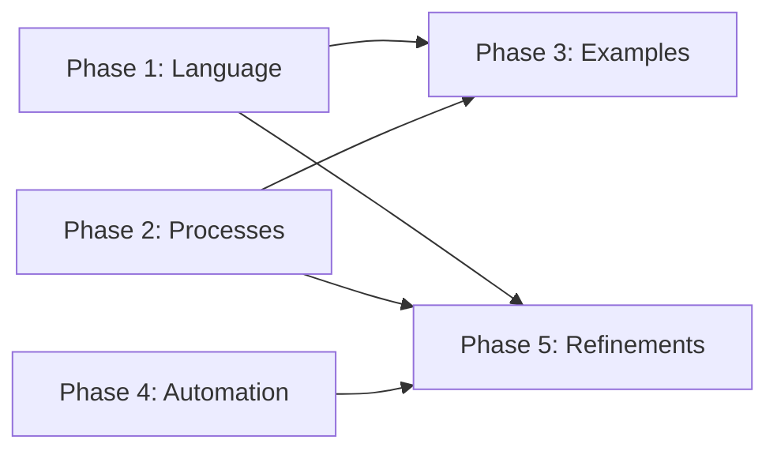

# Implementation Plan for Spec-Building Process Improvements

## Overview
This plan addresses the weaknesses identified in the self-review, focusing on preventing agent panic, filling process gaps, and improving practical usability.

## Work Unit Definition
- **1 Work Unit (WU)** = Effort to complete a well-defined, focused task
- **Small (S)** = 1-2 WU
- **Medium (M)** = 3-5 WU  
- **Large (L)** = 6-10 WU
- **Extra Large (XL)** = 11-20 WU

## Phase 1: Language Flexibility (Total: 15 WU)

### 1.1 Add Flexibility Clauses (8 WU)
**Objective**: Prevent agent panic by providing escape paths for strict requirements

**Work Items**:
- Review all "MUST", "MUST NOT", "NON-NEGOTIABLE" statements (2 WU)
- Add contextual escape clauses to each (3 WU)
- Create escalation decision trees (2 WU)
- Update quality gate language (1 WU)

**Deliverables**:
```markdown
Example transformation:
BEFORE: "MUST achieve 85/100 quality score"
AFTER: "Target 85/100 quality score. If 80-84:
  - Document specific gaps
  - Assess implementation risk
  - Get stakeholder approval with mitigation plan
  - Flag for priority improvement in next iteration"
```

### 1.2 Clarify Vague Instructions (7 WU)
**Objective**: Replace ambiguous terms with specific, actionable steps

**Work Items**:
- Identify all vague terms like "systematically", "thoroughly", "properly" (2 WU)
- Create specific step-by-step replacements (3 WU)
- Add measurement criteria where applicable (2 WU)

**Deliverables**:
- Updated instructions with concrete steps
- Measurement criteria for subjective assessments
- Decision flowcharts for complex evaluations

## Phase 2: Process Gap Filling (Total: 25 WU)

### 2.1 Failure Recovery Processes (10 WU)
**Objective**: Define what to do when things go wrong

**Work Items**:
- Create phase failure recovery guide (3 WU)
- Design rollback procedures (2 WU)
- Document partial completion handling (2 WU)
- Build failure analysis template (2 WU)
- Add recovery escalation paths (1 WU)

**New File**: `spec-building/failure-recovery-guide.md`
```markdown
Structure:
1. Failure Detection Criteria
2. Immediate Response Procedures
3. Impact Assessment Framework
4. Recovery Options:
   - Rollback
   - Partial acceptance
   - Re-planning
   - Scope adjustment
5. Lessons Learned Capture
6. Prevention Strategies
```

### 2.2 Change Management Process (8 WU)
**Objective**: Handle requirement changes gracefully

**Work Items**:
- Design change request template (1 WU)
- Create impact analysis framework (2 WU)
- Build approval workflow (2 WU)
- Document update procedures (2 WU)
- Add version control strategy (1 WU)

**New File**: `spec-building/change-management.md`
```markdown
Structure:
1. Change Request Process
2. Impact Analysis
   - Downstream effects
   - Timeline impacts
   - Resource implications
3. Approval Matrix
4. Document Update Workflow
5. Communication Plan
6. Change History Tracking
```

### 2.3 Estimation Calibration System (7 WU)
**Objective**: Improve estimation accuracy over time

**Work Items**:
- Create estimation tracking template (2 WU)
- Build historical data collection process (2 WU)
- Design calibration algorithm (2 WU)
- Add complexity factors guide (1 WU)

**New File**: `spec-building/templates/estimation-calibration.md`

## Phase 3: Practical Examples (Total: 20 WU)

### 3.1 Complete Worked Example (15 WU)
**Objective**: Show entire process with real project

**Work Items**:
- Define example project (Task Management App) (1 WU)
- Create filled templates (3 WU)
- Generate example SPEC.md with scoring (3 WU)
- Build example roadmap (2 WU)
- Create example phase plans (3 WU)
- Show validation results (2 WU)
- Document decision points (1 WU)

**New Directory**: `spec-building/example-project/`
```
example-project/
├── requirements/
│   ├── outcome-definition-filled.md
│   ├── acceptance-scenarios-filled.md
│   └── nfr-filled.md
├── spec/
│   ├── SPEC.md (with quality scores)
│   ├── quality-review-report.md
│   └── improvement-iterations.md
├── roadmap/
│   ├── ROADMAP.md
│   ├── dependency-analysis.md
│   └── phase-definitions.md
└── plans/
    ├── phase-1-work-plan.md
    ├── phase-1-review-plan.md
    └── alignment-validation-report.md
```

### 3.2 Template Examples (5 WU)
**Objective**: Add concrete examples to each template

**Work Items**:
- Add 2-3 real examples per template (3 WU)
- Include both good and bad examples (1 WU)
- Add explanatory notes (1 WU)

## Phase 4: Automation Implementation (Total: 18 WU)

### 4.1 Validation Scripts (12 WU)
**Objective**: Deliver promised automation

**Work Items**:
- `validate-spec-roadmap.py` - Check requirement coverage (3 WU)
- `validate-roadmap-plans.py` - Verify plan existence (2 WU)
- `validate-plan-alignment.py` - Compare checkpoints (3 WU)
- `generate-validation-report.py` - Create reports (2 WU)
- `check-cross-references.py` - Verify links (2 WU)

**New Directory**: `scripts/validation/`

### 4.2 Helper Scripts (6 WU)
**Objective**: Automate repetitive tasks

**Work Items**:
- `score-spec-quality.py` - Calculate quality scores (2 WU)
- `generate-templates.py` - Create project templates (2 WU)
- `sync-documents.py` - Keep docs aligned (2 WU)

## Phase 5: Refinements (Total: 12 WU)

### 5.1 Complexity Factors (5 WU)
**Objective**: Better effort estimation

**Work Items**:
- Define complexity dimensions (1 WU)
- Create multiplier tables (2 WU)
- Add project type factors (1 WU)
- Document usage guide (1 WU)

**Update**: Add to each process file
```markdown
## Complexity Factors
- Simple (1x): <5 components, 1-2 integrations, well-known tech
- Medium (2x): 5-15 components, 3-5 integrations, some new tech
- Complex (3.5x): 15+ components, 5+ integrations, novel tech
- Enterprise (5x): Add compliance, multiple teams, legacy integration
```

### 5.2 Skills Matrix (4 WU)
**Objective**: Define required skills per phase

**Work Items**:
- Map skills to each phase (2 WU)
- Define proficiency levels (1 WU)
- Create team composition guide (1 WU)

### 5.3 Anti-Pattern Warnings (3 WU)
**Objective**: Help agents avoid common mistakes

**Work Items**:
- Document top 10 anti-patterns (2 WU)
- Add detection criteria (1 WU)

## Implementation Schedule

### Priority Order (High to Low):
1. **Phase 1**: Language Flexibility (15 WU) - Prevents agent panic
2. **Phase 2**: Process Gaps (25 WU) - Fills critical missing pieces  
3. **Phase 3**: Worked Example (20 WU) - Makes everything concrete
4. **Phase 4**: Automation (18 WU) - Delivers on promises
5. **Phase 5**: Refinements (12 WU) - Nice-to-have improvements

**Total Work Units**: 90 WU

### Parallel Work Opportunities:
- Phase 1 and Phase 2.1 can run in parallel
- Phase 3 can start after Phase 1
- Phase 4 can start anytime (independent)
- Phase 5 can be interleaved with others

### Dependencies:


## Success Criteria

### Reduced Agent Panic
- Zero absolute requirements without escape clauses
- All vague terms replaced with specific actions
- Clear escalation paths for all blockers

### Complete Process Coverage
- Failure scenarios documented
- Change management defined
- All promises fulfilled (automation)

### Practical Usability
- Complete worked example available
- Every template has real examples
- Automation reduces manual work by 50%

### Improved Accuracy
- Estimation within 20% of actual
- Complexity factors validated
- Historical data drives improvements

## Risk Mitigation

| Risk | Impact | Mitigation |
|------|--------|------------|
| Scope creep | High | Strict WU tracking, phase gates |
| Over-engineering | Medium | Focus on MVP for each item |
| Inconsistency | Medium | Single owner per phase |
| Adoption resistance | Low | Show value with examples first |

## Next Actions

1. Prioritize Phase 1 for immediate agent usability improvement
2. Assign owners to each phase
3. Set up WU tracking system
4. Create review checkpoints every 20 WU
5. Plan user testing with example project