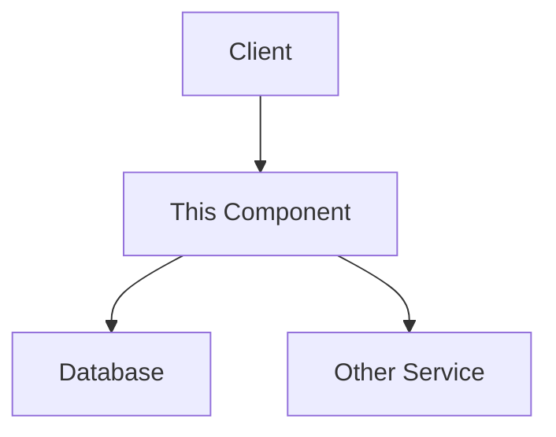

# MDBook Documentation Process

## Overview
This process defines how to create and maintain comprehensive project documentation using MDBook, ensuring that specifications, implementation details, and user guides are accessible and up-to-date.

## MDBook Structure

### Standard Project Documentation Layout
```
docs/
├── book.toml                 # MDBook configuration
├── src/
│   ├── SUMMARY.md           # Table of contents
│   ├── introduction.md      # Project overview
│   ├── getting-started/
│   │   ├── installation.md
│   │   ├── quickstart.md
│   │   └── tutorials/
│   ├── specifications/      # Generated from .spec/
│   │   ├── overview.md
│   │   ├── architecture.md
│   │   ├── components/
│   │   └── interfaces/
│   ├── development/
│   │   ├── setup.md
│   │   ├── contributing.md
│   │   ├── testing.md
│   │   └── debugging.md
│   ├── api-reference/       # Generated from code
│   │   ├── rest-api.md
│   │   ├── graphql.md
│   │   └── sdk/
│   ├── operations/
│   │   ├── deployment.md
│   │   ├── monitoring.md
│   │   ├── troubleshooting.md
│   │   └── runbooks/
│   └── appendix/
│       ├── glossary.md
│       ├── changelog.md
│       └── license.md
├── theme/                   # Custom styling
└── plugins/                 # MDBook plugins
```

## MDBook Configuration

### Basic book.toml
```toml
[book]
title = "Project Documentation"
authors = ["Your Team"]
description = "Comprehensive documentation for [Project Name]"
language = "en"
multilingual = false
src = "src"

[build]
build-dir = "book"
create-missing = true

[preprocessor.mermaid]
command = "mdbook-mermaid"

[preprocessor.toc]
command = "mdbook-toc"
renderer = ["html"]

[preprocessor.plantuml]
command = "mdbook-plantuml"
plantuml-cmd = "plantuml"

[output.html]
theme = "theme"
default-theme = "light"
preferred-dark-theme = "navy"
copy-fonts = true
mathjax-support = true
git-repository-url = "https://github.com/yourorg/yourproject"
edit-url-template = "https://github.com/yourorg/yourproject/edit/main/docs/{path}"

[output.html.playground]
editable = true
copy-js = true

[output.html.search]
enable = true
limit-results = 30
teaser-word-count = 30
use-boolean-and = true
boost-title = 2
boost-hierarchy = 1
boost-paragraph = 1
expand = true
heading-split-level = 3

[output.linkcheck]
follow-web-links = true
warning-policy = "warn"
```

## MDBook Plugins

### Essential Plugins

1. **mdbook-mermaid**: Diagram support
   ```bash
   cargo install mdbook-mermaid
   ```

2. **mdbook-toc**: Table of contents generation
   ```bash
   cargo install mdbook-toc
   ```

3. **mdbook-plantuml**: UML diagrams
   ```bash
   cargo install mdbook-plantuml
   ```

4. **mdbook-linkcheck**: Verify all links
   ```bash
   cargo install mdbook-linkcheck
   ```

5. **mdbook-admonish**: Callout blocks
   ```bash
   cargo install mdbook-admonish
   ```

### Plugin Configuration

#### Admonish for Callouts
```toml
[preprocessor.admonish]
command = "mdbook-admonish"
assets_version = "2.0.0"

[preprocessor.admonish.default]
collapsible = false

[output.html]
additional-css = ["./mdbook-admonish.css"]
```

Usage in markdown:
````markdown
```admonish warning
This is a warning message
```

```admonish info title="Custom Title"
Information with custom title
```

```admonish tip collapsible=true
Collapsible tip content
```
````

## Documentation Templates

### Component Documentation Template
```markdown
# Component Name

<!-- toc -->

## Overview
Brief description of the component's purpose and role in the system.

## Architecture


## API Reference

### Endpoints

#### GET /api/resource
Description of endpoint

**Request**
```json
{
  "param": "value"
}
```

**Response**
```json
{
  "result": "data"
}
```

## Configuration

| Parameter | Type | Default | Description |
|-----------|------|---------|-------------|
| `api.port` | int | 8080 | API server port |
| `db.host` | string | localhost | Database host |

## Development

### Local Setup
```bash
# Clone repository
git clone ...

# Install dependencies
npm install

# Run tests
npm test
```

### Testing
```admonish info
Run tests before submitting PRs
```

## Deployment

### Prerequisites
- Docker 20.10+
- Kubernetes 1.20+

### Steps
1. Build image: `docker build -t component:latest .`
2. Push to registry: `docker push ...`
3. Deploy: `kubectl apply -f k8s/`

## Monitoring

### Metrics
- `component_requests_total`: Total requests
- `component_errors_total`: Total errors
- `component_latency_seconds`: Request latency

### Alerts
| Alert | Condition | Action |
|-------|-----------|--------|
| High Error Rate | >5% errors | Check logs |
| High Latency | p95 > 1s | Scale up |

## Troubleshooting

### Common Issues

#### Issue: Connection Refused
**Symptoms**: Cannot connect to service

**Solution**:
1. Check service is running
2. Verify port configuration
3. Check firewall rules

## Changelog
See [CHANGELOG.md](./changelog.md)
```

### API Documentation Template
```markdown
# API Reference

<!-- toc -->

## Overview
Base URL: `https://api.example.com/v1`

## Authentication
```admonish warning
All endpoints require authentication
```

### Bearer Token
```http
Authorization: Bearer <token>
```

## Endpoints

### User Management

#### Create User
`POST /users`

Creates a new user account.

**Request Body**
```json
{
  "email": "user@example.com",
  "name": "John Doe",
  "role": "user"
}
```

**Response**
```json
{
  "id": "123",
  "email": "user@example.com",
  "name": "John Doe",
  "role": "user",
  "created_at": "2024-01-01T00:00:00Z"
}
```

**Status Codes**
- `201`: User created
- `400`: Invalid request
- `409`: Email already exists

#### Get User
`GET /users/{id}`

Retrieves user information.

**Path Parameters**
- `id` (required): User ID

**Response**
```json
{
  "id": "123",
  "email": "user@example.com",
  "name": "John Doe",
  "role": "user"
}
```

## Error Responses

All errors follow this format:
```json
{
  "error": {
    "code": "ERROR_CODE",
    "message": "Human readable message",
    "details": {}
  }
}
```

### Error Codes
| Code | Description |
|------|-------------|
| `INVALID_REQUEST` | Request validation failed |
| `UNAUTHORIZED` | Authentication required |
| `FORBIDDEN` | Insufficient permissions |
| `NOT_FOUND` | Resource not found |
| `INTERNAL_ERROR` | Server error |

## Rate Limiting

Requests are limited to:
- 100 requests per minute for authenticated users
- 20 requests per minute for unauthenticated users

Rate limit headers:
```http
X-RateLimit-Limit: 100
X-RateLimit-Remaining: 99
X-RateLimit-Reset: 1609459200
```

## Versioning

API version is specified in the URL path:
- Current: `/v1`
- Deprecated: `/v0` (sunset date: 2024-12-31)

## SDKs

Official SDKs available:
- [JavaScript/TypeScript](./sdk/javascript.md)
- [Python](./sdk/python.md)
- [Go](./sdk/go.md)
```

## Documentation Generation

### From Specifications
Create a script to sync spec files to MDBook:

```bash
#!/bin/bash
# sync-specs.sh

SPEC_DIR="../.spec"
DOCS_DIR="docs/src/specifications"

# Clear existing
rm -rf $DOCS_DIR/*

# Copy structure
cp -r $SPEC_DIR/* $DOCS_DIR/

# Update paths in markdown files
find $DOCS_DIR -name "*.md" -exec sed -i 's|\.\.\/\.spec|specifications|g' {} \;

# Generate SUMMARY entries
echo "## Specifications" >> docs/src/SUMMARY.md
find $DOCS_DIR -name "*.md" | sort | while read file; do
    title=$(grep "^# " "$file" | head -1 | sed 's/# //')
    path=${file#docs/src/}
    echo "- [$title]($path)" >> docs/src/SUMMARY.md
done
```

### From Code Comments
Use documentation generators:

```javascript
// For JavaScript/TypeScript
// Install: npm install -g documentation

/**
 * Creates a new user account
 * @param {Object} userData - User information
 * @param {string} userData.email - User email
 * @param {string} userData.name - User name
 * @returns {Promise<User>} Created user object
 * @example
 * const user = await createUser({
 *   email: 'user@example.com',
 *   name: 'John Doe'
 * });
 */
async function createUser(userData) {
    // Implementation
}

// Generate: documentation build src/** -f md -o docs/src/api-reference/
```

## Continuous Documentation

### GitHub Actions Workflow
```yaml
name: Documentation

on:
  push:
    branches: [main]
    paths:
      - 'docs/**'
      - '.spec/**'
      - 'src/**'

jobs:
  build:
    runs-on: ubuntu-latest
    steps:
      - uses: actions/checkout@v3
      
      - name: Setup mdBook
        uses: peaceiris/actions-mdbook@v1
        with:
          mdbook-version: '0.4.28'
      
      - name: Install plugins
        run: |
          cargo install mdbook-mermaid
          cargo install mdbook-linkcheck
          cargo install mdbook-toc
          
      - name: Sync specifications
        run: ./scripts/sync-specs.sh
        
      - name: Generate API docs
        run: |
          npm ci
          npm run docs:api
          
      - name: Build book
        run: mdbook build docs
        
      - name: Deploy to GitHub Pages
        uses: peaceiris/actions-gh-pages@v3
        with:
          github_token: ${{ secrets.GITHUB_TOKEN }}
          publish_dir: ./docs/book
```

### Documentation Standards

1. **Keep docs next to code**: Component docs in component directory
2. **Auto-generate when possible**: API docs from code comments
3. **Version documentation**: Tag docs with releases
4. **Review documentation**: Include in PR reviews
5. **Test documentation**: Verify examples work

### Living Documentation

Update triggers:
- Code changes → API doc regeneration
- Spec changes → Specification sync
- Release → Changelog update
- Issues → Troubleshooting additions

## Review Process

Documentation review checklist:
- [ ] Technical accuracy
- [ ] Completeness
- [ ] Code examples tested
- [ ] Links verified
- [ ] Diagrams clear
- [ ] Consistent style
- [ ] Search-friendly titles

## Next Steps

1. Set up MDBook with plugins
2. Create initial structure
3. Migrate existing documentation
4. Set up CI/CD pipeline
5. Train team on documentation process
6. Establish review guidelines