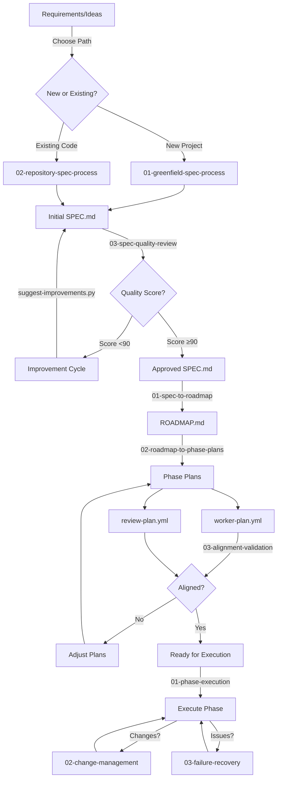

# Spec-to-Execution Process Flow

## Overview
This document provides a complete view of the specification-to-execution pipeline, showing how each process connects to create a seamless workflow from initial requirements to executable phase plans.

## Process Flow Diagram



## Detailed Process Steps

### Phase 1: Spec Creation (01-spec-creation/)

#### Path A: Greenfield Projects
**Process**: `01-greenfield-spec-process.md`
**Duration**: 20-30 hours total

**Stage 1: Requirements Discovery** (Day 1-2)
- Generate templates: `python automation/generate-spec-template.py`
- Fill templates:
  - `templates/requirements/outcome-definition.md`
  - `templates/requirements/acceptance-scenarios.md`
  - `templates/requirements/non-functional-requirements.md`
- Conduct stakeholder interviews
- Document all assumptions

**Stage 2: Spec Development** (Day 3-5)
- Follow greenfield process steps
- Use all requirement templates
- Build comprehensive SPEC.md
- Include architecture and risks

#### Path B: Existing Codebases
**Process**: `02-repository-spec-process.md`
**Duration**: 15-25 hours total

**Stage 1: Code Analysis** (Day 1-2)
- Map repository structure
- Extract architecture patterns
- Identify business logic
- Document technical debt

**Stage 2: Spec Generation** (Day 3-4)
- Reverse-engineer requirements
- Document current state
- Identify gaps
- Create SPEC.md

#### Quality Review (Both Paths)
**Process**: `03-spec-quality-review.md`
**Duration**: 5-15 hours

**Stage 3: Quality Improvement** (Day 6-7)
- Run quality scoring: `python automation/validation/score-spec-quality.py`
- Target score: 90+ (required)
- Get improvement suggestions: `python automation/improvement/suggest-spec-improvements.py`
- Iterate until score achieved

**Quality Gate**: Score must be ≥90 to proceed

### Phase 2: Planning (02-planning/)

#### Roadmap Creation
**Process**: `01-spec-to-roadmap.md`
**Duration**: 7-12 hours (Day 8-9)
**Input**: Approved SPEC.md (90+ score)

**Activities**:
1. Dependency analysis
2. Phase identification
3. Sequencing optimization
4. Milestone definition
5. Validation and documentation

**Outputs**:
- ROADMAP.md with phases
- Dependency matrix
- Timeline with milestones
- Resource allocation

**Quality Checks**:
- All requirements mapped
- Dependencies satisfied
- Phases properly sized

### Stage 6: Phase Planning (Day 11-12)

**Process**: `3-roadmap-to-phase-plan.md`
**Duration**: 4-6 hours per phase
**Inputs**: ROADMAP.md

**Activities**:
1. Extract phase requirements
2. Create work breakdown
3. Define checkpoints
4. Develop review criteria
5. Align plans

**Outputs**:
```
.plan/
├── phase-1/
│   ├── WORK_PLAN.md
│   └── REVIEW_PLAN.md
├── phase-2/
│   ├── WORK_PLAN.md
│   └── REVIEW_PLAN.md
```

**Quality Checks**:
- Checkpoints aligned
- TDD enforced
- Resources matched

### Stage 7: Alignment Validation (Day 13)

**Process**: `alignment-validation.md`
**Duration**: 2-3 hours
**Inputs**: All generated documents

**Activities**:
1. Spec → Roadmap validation
2. Roadmap → Plans validation
3. Worker ↔ Review alignment
4. Cross-plan consistency

**Outputs**:
- Alignment validation report
- Gap resolution plan
- Approval sign-offs

**Quality Gate**: No blocking issues

### Stage 8: Documentation Setup (Day 14)

**Process**: `4-mdbook-documenting.md`
**Duration**: 4-6 hours
**Inputs**: All project documents

**Activities**:
1. Set up MDBook structure
2. Configure plugins
3. Sync specifications
4. Create CI/CD pipeline

**Outputs**:
- Living documentation site
- Automated update process
- Documentation standards

## Role Responsibilities

### Product Owner
- Provide requirements
- Validate specifications
- Approve roadmap
- Sign off on phases

### Technical Lead
- Review architecture
- Validate technical feasibility
- Approve technology choices
- Oversee implementation

### Quality Assurance
- Define acceptance criteria
- Review test strategies
- Validate quality gates
- Approve review plans

### Development Team
- Provide estimates
- Validate work plans
- Identify risks
- Execute implementation

## Process Metrics

### Time Investment
| Stage | Duration | Cumulative |
|-------|----------|------------|
| Requirements | 4-8 hours | 4-8 hours |
| Specification | 20-30 hours | 24-38 hours |
| Quality Review | 9-16 hours | 33-54 hours |
| Modularization | 3-4 hours | 36-58 hours |
| Roadmap | 7-12 hours | 43-70 hours |
| Phase Planning | 12-18 hours | 55-88 hours |
| Validation | 2-3 hours | 57-91 hours |
| Documentation | 4-6 hours | 61-97 hours |

### Quality Metrics
- Spec Quality Score: Target ≥85/100
- Requirement Coverage: Target 100%
- Alignment Score: Target ≥95%
- Cross-reference Validity: Target 100%

### Success Indicators
- First-time approval rate
- Rework frequency
- Implementation surprises
- Schedule adherence
- Budget compliance

## Common Pitfalls and Mitigations

### Pitfall 1: Incomplete Requirements
**Symptoms**: Low spec scores, many TBDs
**Mitigation**: Enforce template completion, multiple stakeholder reviews

### Pitfall 2: Over-Engineering
**Symptoms**: Analysis paralysis, excessive documentation
**Mitigation**: Time boxes, "good enough" thresholds

### Pitfall 3: Misalignment
**Symptoms**: Validation failures, plan conflicts
**Mitigation**: Regular checkpoints, automated validation

### Pitfall 4: Scope Creep
**Symptoms**: Growing requirements, timeline expansion
**Mitigation**: Formal change control, clear boundaries

## Continuous Improvement

### Feedback Loops
1. Post-phase retrospectives
2. Quality metric tracking
3. Process refinement
4. Template updates
5. Tool improvements

### Optimization Opportunities
- Automate repetitive tasks
- Parallelize where possible
- Reuse proven patterns
- Streamline approvals
- Improve templates

## Quick Reference Checklist

```markdown
## Complete Pipeline Checklist

### Preparation
- [ ] Stakeholders identified
- [ ] Templates ready
- [ ] Time allocated

### Specification
- [ ] Templates filled
- [ ] Spec created
- [ ] Quality reviewed
- [ ] Score ≥85

### Planning
- [ ] Spec modularized
- [ ] Roadmap generated
- [ ] Phases planned
- [ ] Plans aligned

### Validation
- [ ] Alignment checked
- [ ] Issues resolved
- [ ] Approvals obtained
- [ ] Documentation ready

### Ready for Execution
- [ ] All documents complete
- [ ] Quality gates passed
- [ ] Team prepared
- [ ] Tracking established
```

## Next Steps

Once the pipeline is complete:
1. Begin Phase 1 execution
2. Monitor progress against plans
3. Use review checkpoints
4. Update documentation continuously
5. Gather lessons learned
6. Improve process for next project