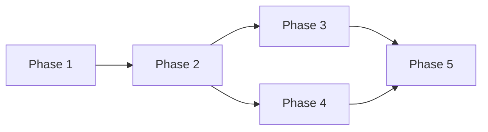

# Project Roadmap Template

## Overview
Brief description of the project and its goals.

## Timeline Summary
- **Total Duration**: X weeks/months
- **Start Date**: YYYY-MM-DD
- **Target Completion**: YYYY-MM-DD

## Phase Overview

| Phase | Name | Duration | Key Deliverables |
|-------|------|----------|------------------|
| 1 | Foundation | X weeks | Core infrastructure, basic features |
| 2 | [Name] | X weeks | [Key deliverables] |
| 3 | [Name] | X weeks | [Key deliverables] |

## Detailed Phases

### Phase 1: Foundation
**Duration**: X weeks  
**Dependencies**: None  
**Team Size**: X developers

#### Objectives
- Set up core infrastructure
- Implement basic authentication
- Create data models
- Establish CI/CD pipeline

#### Requirements Covered
- REQ-001: [Requirement description]
- REQ-002: [Requirement description]
- NFR-001: [Non-functional requirement]

#### Success Criteria
- [ ] All unit tests passing
- [ ] CI/CD pipeline operational
- [ ] Basic API endpoints working
- [ ] Documentation complete

#### Risks
- **Risk 1**: [Description] - Mitigation: [Strategy]
- **Risk 2**: [Description] - Mitigation: [Strategy]

---

### Phase 2: [Name]
**Duration**: X weeks  
**Dependencies**: Phase 1  
**Team Size**: X developers

#### Objectives
- [Objective 1]
- [Objective 2]
- [Objective 3]

#### Requirements Covered
- REQ-XXX: [Requirement description]
- REQ-XXX: [Requirement description]

#### Success Criteria
- [ ] [Criteria 1]
- [ ] [Criteria 2]
- [ ] [Criteria 3]

#### Risks
- **Risk 1**: [Description] - Mitigation: [Strategy]

---

### Phase 3: [Name]
**Duration**: X weeks  
**Dependencies**: Phase 2  
**Team Size**: X developers

#### Objectives
- [Objective 1]
- [Objective 2]

#### Requirements Covered
- REQ-XXX: [Requirement description]

#### Success Criteria
- [ ] [Criteria 1]
- [ ] [Criteria 2]

#### Risks
- **Risk 1**: [Description] - Mitigation: [Strategy]

---

## Dependencies Matrix

## Resource Allocation

| Phase | Frontend | Backend | QA | DevOps |
|-------|----------|---------|----|---------| 
| 1 | 1 | 2 | 0.5 | 1 |
| 2 | 2 | 2 | 1 | 0.5 |
| 3 | 2 | 1 | 1 | 0 |

## Milestones

| Milestone | Date | Description | Acceptance |
|-----------|------|-------------|------------|
| M1 | Week 4 | MVP Ready | Internal demo |
| M2 | Week 8 | Beta Release | Limited users |
| M3 | Week 12 | Production Ready | Full launch |

## Quality Gates

Each phase must meet these criteria before proceeding:
- Code coverage >85%
- All tests passing
- Security scan clear
- Performance benchmarks met
- Documentation updated
- Stakeholder sign-off

## Risk Management

### High-Level Risks
1. **Technical Debt**: Regular refactoring sessions
2. **Scope Creep**: Strict change control process
3. **Resource Availability**: Cross-training plan

### Contingency Plans
- **Schedule Slip**: Pre-identified scope reductions
- **Technology Issues**: Alternative implementation paths
- **Team Changes**: Knowledge transfer protocols

## Success Metrics

### Business Metrics
- [Metric 1]: Target value
- [Metric 2]: Target value

### Technical Metrics
- Performance: <100ms response time
- Availability: 99.9% uptime
- Quality: <1 bug per 1000 LOC

## Communication Plan

### Stakeholder Updates
- Weekly status emails
- Bi-weekly demos
- Monthly steering committee

### Team Coordination
- Daily standups
- Weekly planning
- Phase retrospectives

## Next Steps

1. Review and approve roadmap
2. Create detailed phase plans
3. Assign team members
4. Set up tracking systems
5. Kick off Phase 1