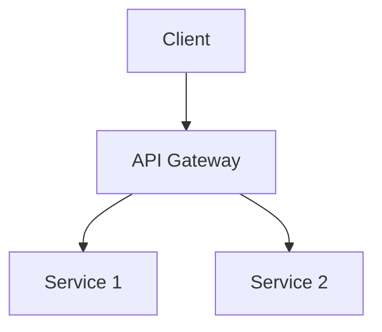

# Spec Improvement Suggestions

Generated for: SPEC.md

## High Priority

- **Issue**: Requirement FR-001 lacks measurable criteria
  - **Suggestion**: Add specific, measurable acceptance criteria
  - **Example**: Add: 'Must handle X requests/second with Y ms response time'

- **Issue**: Requirement FR-002 lacks measurable criteria
  - **Suggestion**: Add specific, measurable acceptance criteria
  - **Example**: Add: 'Must handle X requests/second with Y ms response time'

- **Issue**: Requirement NFR-002 lacks measurable criteria
  - **Suggestion**: Add specific, measurable acceptance criteria
  - **Example**: Add: 'Must handle X requests/second with Y ms response time'

- **Issue**: Requirement NFR-003 lacks measurable criteria
  - **Suggestion**: Add specific, measurable acceptance criteria
  - **Example**: Add: 'Must handle X requests/second with Y ms response time'

- **Issue**: Limited acceptance criteria sections
  - **Suggestion**: Add acceptance criteria for each major requirement
  - **Example**: For each requirement add:
**Acceptance Criteria**:
- [ ] Specific measurable criterion 1
- [ ] Specific measurable criterion 2
- [ ] Performance threshold met

- **Issue**: Success metrics lack baseline data
  - **Suggestion**: Add current state metrics for comparison
  - **Example**: For each metric, show: Current → Target

## Medium Priority

- **Issue**: Architecture section lacks diagrams
  - **Suggestion**: Add system architecture diagram
  - **Example**: Add a Mermaid diagram:

- **Issue**: No deployment architecture described
  - **Suggestion**: Add deployment architecture section
  - **Example**: Add section:
### Deployment Architecture
- Environment strategy (dev/staging/prod)
- Container orchestration
- Scaling approach
- Monitoring and logging

